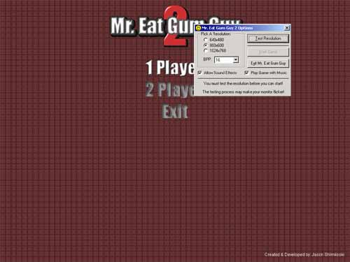



## A Cool DirectX Game

### Description

This is Mr. Eat Gum Guy 2. This version uses Direct Draw, Direct Sound, Direct Music, and Direct Input. It has a 1 Player and 2 Player mode, the user can select the resolution the game should play at as well as the option of whether or not to play sound effects or music. This games file size is very small because I used tiling instead of just plopping a 640x480 sized bitmap on the screen. This is very neato code and must have muchos votes. Hey, if you put this code on planet source code, I would give you 5 stars. Thanks for your time.
 
### More Info
 

             |
---                |---
**Submitted On**   |2001-06-14 22:17:02
**By**             |[Jason Shimkoski](https://github.com/Planet-Source-Code/PSCIndex/blob/master/ByAuthor/jason-shimkoski.md)
**Level**          |Intermediate
**User Rating**    |4.9 (181 globes from 37 users)
**Compatibility**  |VB 6\.0
**Category**       |[DirectX](https://github.com/Planet-Source-Code/PSCIndex/blob/master/ByCategory/directx__1-44.md)
**World**          |[Visual Basic](https://github.com/Planet-Source-Code/PSCIndex/blob/master/ByWorld/visual-basic.md)
**Archive File**   |[A Cool Dir211626142001\.zip](https://github.com/Planet-Source-Code/jason-shimkoski-a-cool-directx-game__1-24091/archive/master.zip)

